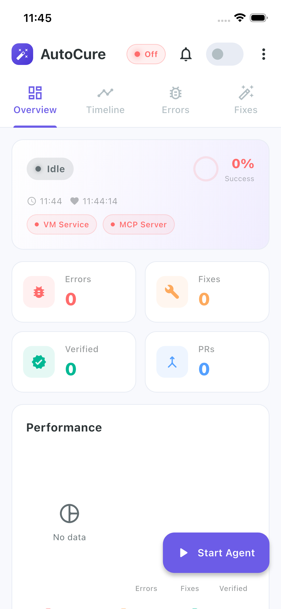
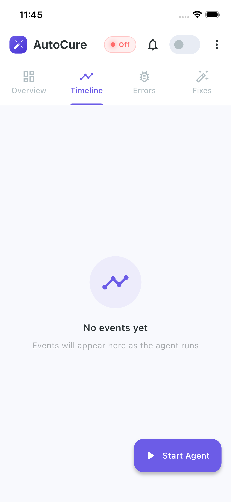
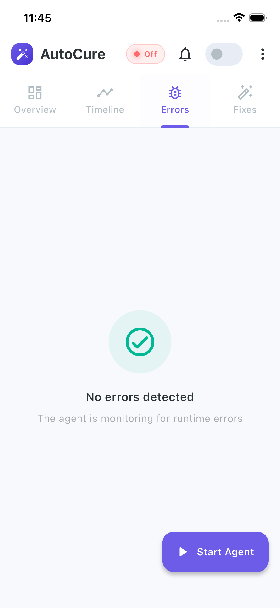
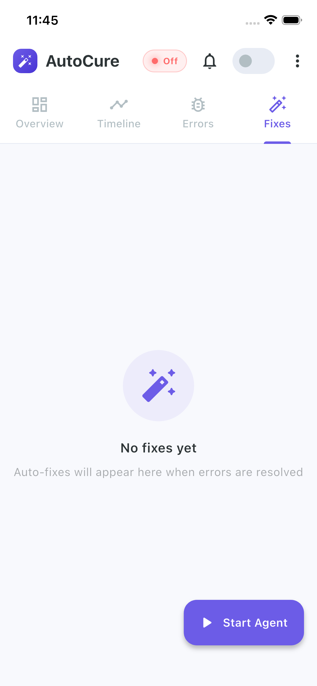
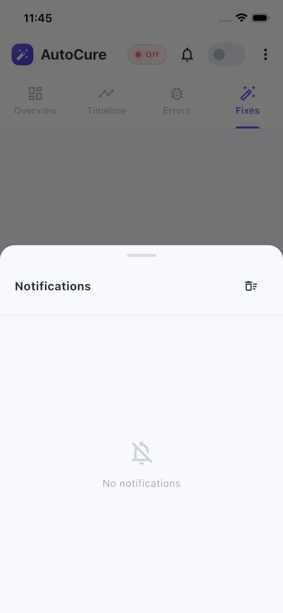
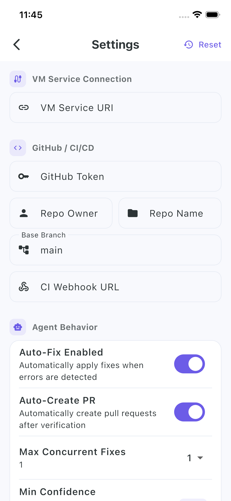
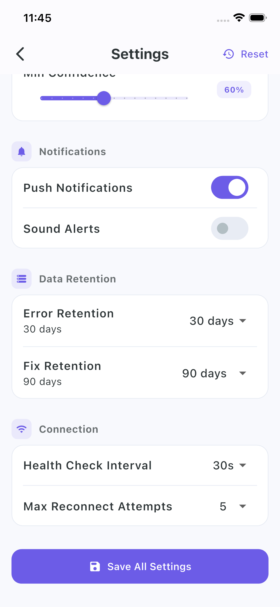
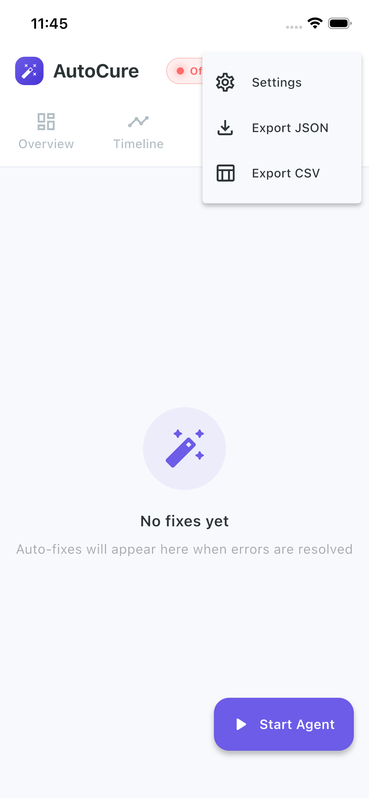

<p align="center">
  
</p>

<h1 align="center">AutoCure</h1>
<p align="center">
  <strong>Self-Healing Flutter Agent</strong><br>
  Flutter 앱의 런타임 오류를 자동으로 탐지 · 분석 · 수정하는 자율 복구 에이전트
</p>

<p align="center">
  
  
  
  
</p>

---

[한국어](#한국어) | [English](#english)

---

## Screenshots

<table>
  <tr>
    <td></td>
    <td></td>
    <td></td>
    <td></td>
  </tr>
  <tr>
    <td align="center"><sub>Overview</sub></td>
    <td align="center"><sub>Timeline</sub></td>
    <td align="center"><sub>Errors</sub></td>
    <td align="center"><sub>Fixes</sub></td>
  </tr>
  <tr>
    <td></td>
    <td></td>
    <td></td>
    <td></td>
  </tr>
  <tr>
    <td align="center"><sub>Notifications</sub></td>
    <td align="center"><sub>Settings</sub></td>
    <td align="center"><sub>Settings Detail</sub></td>
    <td align="center"><sub>Export Menu</sub></td>
  </tr>
</table>

---

# 한국어

Flutter 앱의 런타임 오류를 자동으로 탐지하고, 분석하고, 코드를 수정하는 **자율 복구(Self-Healing)** 관리 에이전트 시스템입니다.

## 지원 플랫폼

| 플랫폼 | 지원 | 비고 |
|--------|:----:|------|
| Android | ✅ | Android 5.0 (API 21) 이상 |
| iOS | ✅ | iOS 12.0 이상 |
| macOS | ✅ | macOS 10.14 이상 |
| Linux | ✅ | x64 |
| Windows | ✅ | Windows 10 이상 |
| Web | ✅ | Chrome, Firefox, Safari, Edge |

---

## Overview

```
런타임 에러 발생
    |
    v
[VM Service] 에러 캡처 (RenderFlex, Null, setState 등)
    |
    v
[ErrorAnalyzer] 루트 원인 분석 + 수정 전략 결정
    |
    v
[CodeFixer] 7가지 자동 수정 전략 적용
    |
    v
[Verification] dart analyze + flutter test 검증
    |
    v
  통과? ──Yes──> [CI/CD] autofix/* 브랜치 PR 생성
    |                        |
   No                   GitHub Actions
    |                   분석/테스트 통과
    v                        |
 자동 롤백               자동 머지
```

---

## Architecture

```
lib/
├── core/
│   ├── mcp/                    # MCP 서버 연동
│   │   ├── mcp_server.dart     # JSON-RPC MCP 서버 (위젯 트리/소스 접근)
│   │   └── widget_inspector.dart # VM Service 위젯 트리 인스펙터
│   ├── self_healing/           # 자가 치유 엔진
│   │   ├── agent.dart          # 메인 오케스트레이터
│   │   ├── error_analyzer.dart # 에러 패턴 분석 + 루트 원인 추적
│   │   ├── code_fixer.dart     # 7가지 자동 수정 전략
│   │   └── verification.dart   # dart analyze + flutter test 검증
│   └── vm_service/             # 런타임 감시
│       ├── vm_connector.dart   # Flutter VM Service 연결
│       └── error_stream.dart   # 실시간 에러 스트림
├── models/                     # 데이터 모델
│   ├── error_report.dart       # 에러 리포트
│   ├── fix_record.dart         # 수정 기록
│   └── agent_status.dart       # 에이전트 상태
├── services/                   # 서비스 레이어
│   ├── agent_provider.dart     # Flutter UI <-> Agent 브릿지
│   └── ci_cd_service.dart      # GitHub API + PR 자동 생성
├── screens/                    # 관리자 대시보드
│   ├── dashboard/
│   │   ├── dashboard_screen.dart
│   │   └── widgets/
│   │       ├── status_card.dart
│   │       ├── agent_status_widget.dart
│   │       ├── error_log_view.dart
│   │       ├── fix_history_list.dart
│   │       ├── stats_chart.dart
│   │       ├── timeline_view.dart
│   │       └── notification_bell.dart
│   └── settings/
│       └── settings_screen.dart
├── theme/
│   └── app_theme.dart          # 디자인 시스템 (컬러, 테마)
└── main.dart                   # 앱 엔트리포인트

tools/
└── mcp_server/bin/server.dart  # 독립 실행 MCP 서버

.github/
└── workflows/
    └── self-heal.yml           # CI/CD 자동 머지 파이프라인
```

---

## Features

### 1. MCP 서버 연동

Dart 기반 MCP(Model Context Protocol) 서버가 에이전트에게 프로젝트 접근 권한을 제공합니다.

| Tool | 설명 |
|------|------|
| `get_widget_tree` | 실행 중인 앱의 위젯 트리 구조 조회 |
| `get_source_code` | Dart 소스 파일 라인 번호 포함 읽기 |
| `analyze_file` | `dart analyze` 실행 및 진단 결과 반환 |
| `apply_fix` | 지정된 코드 영역 자동 수정 |

```bash
# 독립 실행 MCP 서버 시작
dart run tools/mcp_server/bin/server.dart
```

### 2. 런타임 감시

Flutter VM Service Protocol을 통해 실행 중인 앱에 연결하고, 다음 에러들을 실시간으로 캡처합니다:

- **RenderFlex overflowed** - 레이아웃 오버플로우
- **RenderBox was not laid out** - 미배치 렌더 박스
- **Null check operator on null value** - 널 참조
- **setState() called after dispose()** - dispose 이후 setState
- **Type errors** - 타입 캐스팅 실패

### 3. 자가 치유 워크플로우

에러 패턴에 따라 7가지 자동 수정 전략을 적용합니다:

| 전략 | 대상 에러 | 수정 내용 |
|------|----------|----------|
| `WrapWithExpanded` | RenderFlex overflow | 자식 위젯을 `Expanded`로 감싸기 |
| `WrapWithSingleChildScrollView` | 콘텐츠 오버플로우 | `SingleChildScrollView` 래핑 |
| `AddFlexible` | Flex 오버플로우 | `Flexible` 위젯 추가 |
| `AddNullCheck` | Null 참조 | `?.` 및 null safety 적용 |
| `AddMountedCheck` | setState after dispose | `if (!mounted) return;` 가드 삽입 |
| `WrapWithSafeArea` | 시스템 UI 침범 | `SafeArea` 래핑 |
| `AddConstraints` | 무제한 크기 | `SizedBox`/`ConstrainedBox` 추가 |

수정 후 `dart analyze` + `flutter test`로 검증하며, 실패 시 자동 롤백합니다.

### 4. CI/CD 통합

```yaml
# 자동 트리거: autofix/* 브랜치 푸시 시
# 수동 트리거: workflow_dispatch
# 스케줄: 매일 03:00 UTC

analyze → test → auto-merge (성공) / close PR (실패)
```

- `autofix/{error-type}-{timestamp}` 브랜치 자동 생성
- GitHub API를 통한 PR 생성 (에러 설명, 루트 원인, 코드 diff 포함)
- 테스트 통과 시 자동 승인 + squash 머지
- 테스트 실패 시 실패 코멘트 + PR 자동 닫기
- Semaphore CI 등 외부 CI webhook 지원

### 5. 관리자 대시보드

모바일/데스크탑/웹에서 실시간으로 모니터링할 수 있는 관리자 화면:

- **Overview 탭** - 에이전트 상태, 에러/수정/검증/PR 카운트, 성공률 차트
- **Timeline 탭** - 에러와 수정 이벤트를 시간순으로 표시
- **Errors 탭** - 실시간 에러 로그 (심각도, 스택 트레이스, 위젯 경로)
- **Fixes 탭** - 수정 이력 (원본/수정 코드 diff, 테스트 결과, PR 링크)
- **Notifications** - 실시간 알림 (에러 탐지, 수정 완료, PR 생성 등)
- **Settings** - VM Service 연결, GitHub/CI 설정, 에이전트 동작 설정, 알림 설정

### 6. 디자인 시스템

커스텀 컬러 팔레트와 통일된 디자인 시스템을 적용했습니다:

| 용도 | 컬러 | Hex |
|------|------|-----|
| Primary | 퍼플 | `#6C5CE7` |
| Accent | 시안 | `#00D2D3` |
| Success | 민트 그린 | `#00B894` |
| Warning | 소프트 오렌지 | `#FDAA5E` |
| Error | 코랄 레드 | `#FF6B6B` |
| Info | 스카이 블루 | `#54A0FF` |

라이트/다크 모드 완전 지원, 그라데이션 바 차트, 글로우 효과 타임라인 등 모던 UI를 제공합니다.

---

## 사용 방법

### 1단계: 설치

```bash
git clone https://github.com/kimdzhekhon/Auto_Cure.git
cd Auto_Cure
flutter pub get
```

### 2단계: AutoCure 대시보드 실행

```bash
flutter run              # 모바일
flutter run -d macos     # macOS
flutter run -d windows   # Windows
flutter run -d linux     # Linux
flutter run -d chrome    # 웹
```

### 3단계: 대상 Flutter 앱과 연결

```bash
cd /path/to/your/flutter/app
flutter run --debug
```

터미널 출력에서 VM Service URI를 확인합니다:

```
An Observatory debugger and profiler on ... is available at:
http://127.0.0.1:XXXXX/XXXXXX=/
```

AutoCure 대시보드의 **Start Agent** 버튼을 탭하고 URI를 입력하면 연결됩니다.

### 4단계: 자동 복구 활성화

1. 대시보드에서 **Agent ON/OFF 토글**을 켭니다.
2. 에이전트가 대상 앱의 런타임 에러를 실시간으로 감시합니다.
3. 에러 발생 시 자동으로 분석 → 수정 → 검증 → PR 생성까지 진행합니다.

### 5단계: MCP 서버 (선택사항)

```bash
dart run tools/mcp_server/bin/server.dart
```

### 6단계: CI/CD 설정 (선택사항)

```bash
export GITHUB_TOKEN=your_token
export AUTOCURE_REPO_OWNER=kimdzhekhon
export AUTOCURE_REPO_NAME=Auto_Cure
```

---

## Tech Stack

| 영역 | 기술 |
|------|------|
| Framework | Flutter 3.11+ / Dart 3.11+ |
| 런타임 감시 | `vm_service`, `web_socket_channel` |
| 상태 관리 | `provider` |
| 차트 | `fl_chart` |
| CI/CD | GitHub Actions, GitHub API |
| MCP 통신 | JSON-RPC 2.0 over stdin/stdout |
| 프로세스 관리 | `process_run` |

---
---

# English

A **self-healing** autonomous agent system that automatically detects, analyzes, and fixes runtime errors in Flutter apps.

## Supported Platforms

| Platform | Supported | Notes |
|----------|:---------:|-------|
| Android | ✅ | Android 5.0 (API 21)+ |
| iOS | ✅ | iOS 12.0+ |
| macOS | ✅ | macOS 10.14+ |
| Linux | ✅ | x64 |
| Windows | ✅ | Windows 10+ |
| Web | ✅ | Chrome, Firefox, Safari, Edge |

---

## Overview

```
Runtime error occurs
    |
    v
[VM Service] Capture error (RenderFlex, Null, setState, etc.)
    |
    v
[ErrorAnalyzer] Root cause analysis + fix strategy selection
    |
    v
[CodeFixer] Apply one of 7 auto-fix strategies
    |
    v
[Verification] Verify with dart analyze + flutter test
    |
    v
  Pass? ──Yes──> [CI/CD] Create PR on autofix/* branch
    |                        |
   No                   GitHub Actions
    |                   analysis/test pass
    v                        |
 Auto-rollback          Auto-merge
```

---

## Architecture

```
lib/
├── core/
│   ├── mcp/                    # MCP server integration
│   │   ├── mcp_server.dart     # JSON-RPC MCP server (widget tree/source access)
│   │   └── widget_inspector.dart # VM Service widget tree inspector
│   ├── self_healing/           # Self-healing engine
│   │   ├── agent.dart          # Main orchestrator
│   │   ├── error_analyzer.dart # Error pattern analysis + root cause tracing
│   │   ├── code_fixer.dart     # 7 auto-fix strategies
│   │   └── verification.dart   # dart analyze + flutter test verification
│   └── vm_service/             # Runtime monitoring
│       ├── vm_connector.dart   # Flutter VM Service connection
│       └── error_stream.dart   # Real-time error stream
├── models/                     # Data models
├── services/                   # Service layer
│   ├── agent_provider.dart     # Flutter UI <-> Agent bridge
│   └── ci_cd_service.dart      # GitHub API + auto PR creation
├── screens/                    # Admin dashboard
├── theme/
│   └── app_theme.dart          # Design system (colors, themes)
└── main.dart                   # App entry point

tools/
└── mcp_server/bin/server.dart  # Standalone MCP server

.github/
└── workflows/
    └── self-heal.yml           # CI/CD auto-merge pipeline
```

---

## Features

### 1. MCP Server Integration

A Dart-based MCP (Model Context Protocol) server provides project access to the agent.

| Tool | Description |
|------|-------------|
| `get_widget_tree` | Inspect the running app's widget tree structure |
| `get_source_code` | Read Dart source files with line numbers |
| `analyze_file` | Run `dart analyze` and return diagnostics |
| `apply_fix` | Auto-fix a specified code region |

### 2. Runtime Monitoring

Connects to a running app via Flutter VM Service Protocol and captures errors in real time:

- **RenderFlex overflowed** - Layout overflow
- **RenderBox was not laid out** - Unlaid render box
- **Null check operator on null value** - Null reference
- **setState() called after dispose()** - setState after dispose
- **Type errors** - Type casting failures

### 3. Self-Healing Workflow

Applies 7 automatic fix strategies based on error patterns:

| Strategy | Target Error | Fix Applied |
|----------|-------------|-------------|
| `WrapWithExpanded` | RenderFlex overflow | Wrap child widget with `Expanded` |
| `WrapWithSingleChildScrollView` | Content overflow | Wrap with `SingleChildScrollView` |
| `AddFlexible` | Flex overflow | Add `Flexible` widget |
| `AddNullCheck` | Null reference | Apply `?.` and null safety |
| `AddMountedCheck` | setState after dispose | Insert `if (!mounted) return;` guard |
| `WrapWithSafeArea` | System UI intrusion | Wrap with `SafeArea` |
| `AddConstraints` | Unbounded size | Add `SizedBox`/`ConstrainedBox` |

After applying a fix, it verifies with `dart analyze` + `flutter test` and auto-rollbacks on failure.

### 4. CI/CD Integration

- Auto-creates `autofix/{error-type}-{timestamp}` branches
- Creates PRs via GitHub API (with error description, root cause, code diff)
- Auto-approves + squash merges on test pass
- Posts failure comment + closes PR on test failure
- Supports external CI webhooks (e.g., Semaphore CI)

### 5. Admin Dashboard

A real-time monitoring dashboard available on mobile, desktop, and web:

- **Overview tab** - Agent status, error/fix/verified/PR counts, success rate chart
- **Timeline tab** - Chronological view of error and fix events
- **Errors tab** - Live error log (severity, stack trace, widget path)
- **Fixes tab** - Fix history (original/fixed code diff, test results, PR links)
- **Notifications** - Real-time alerts (error detected, fix applied, PR created)
- **Settings** - VM Service connection, GitHub/CI config, agent behavior, notification settings

### 6. Design System

Custom color palette with a unified design system:

| Usage | Color | Hex |
|-------|-------|-----|
| Primary | Purple | `#6C5CE7` |
| Accent | Cyan | `#00D2D3` |
| Success | Mint Green | `#00B894` |
| Warning | Soft Orange | `#FDAA5E` |
| Error | Coral Red | `#FF6B6B` |
| Info | Sky Blue | `#54A0FF` |

Full light/dark mode support, gradient bar charts, glowing timeline effects, and modern UI throughout.

---

## Usage

### Step 1: Installation

```bash
git clone https://github.com/kimdzhekhon/Auto_Cure.git
cd Auto_Cure
flutter pub get
```

### Step 2: Run the AutoCure Dashboard

```bash
flutter run              # Mobile
flutter run -d macos     # macOS
flutter run -d windows   # Windows
flutter run -d linux     # Linux
flutter run -d chrome    # Web
```

### Step 3: Connect to a Target Flutter App

```bash
cd /path/to/your/flutter/app
flutter run --debug
```

Find the VM Service URI in the terminal output:

```
An Observatory debugger and profiler on ... is available at:
http://127.0.0.1:XXXXX/XXXXXX=/
```

Tap **Start Agent** in the AutoCure dashboard and enter the URI.

### Step 4: Enable Auto-Healing

1. Turn on the **Agent ON/OFF toggle** in the dashboard.
2. The agent starts monitoring the target app's runtime errors in real time.
3. When an error occurs, it automatically analyzes, fixes, verifies, and creates a PR.

### Step 5: MCP Server (Optional)

```bash
dart run tools/mcp_server/bin/server.dart
```

### Step 6: CI/CD Setup (Optional)

```bash
export GITHUB_TOKEN=your_token
export AUTOCURE_REPO_OWNER=kimdzhekhon
export AUTOCURE_REPO_NAME=Auto_Cure
```

---

## Tech Stack

| Area | Technology |
|------|-----------|
| Framework | Flutter 3.11+ / Dart 3.11+ |
| Runtime Monitoring | `vm_service`, `web_socket_channel` |
| State Management | `provider` |
| Charts | `fl_chart` |
| CI/CD | GitHub Actions, GitHub API |
| MCP Communication | JSON-RPC 2.0 over stdin/stdout |
| Process Management | `process_run` |

---

## License

This project is licensed under the MIT License.
